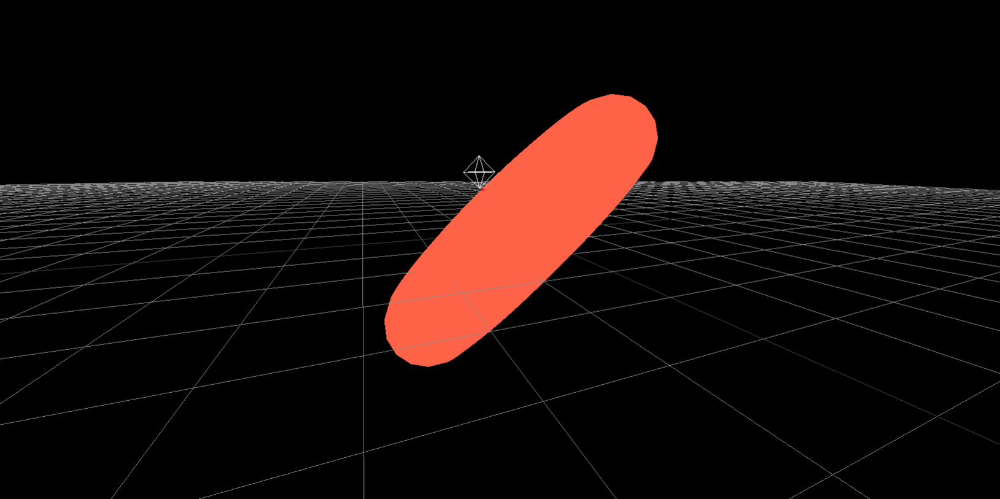
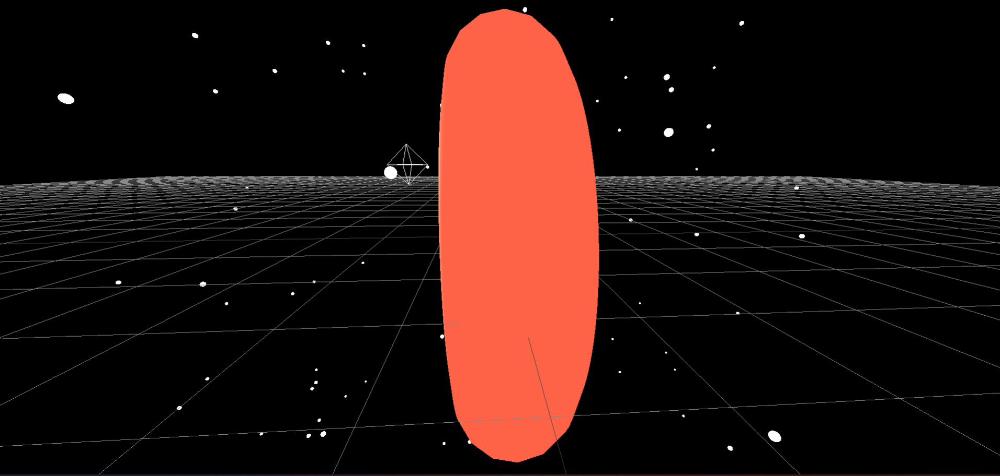
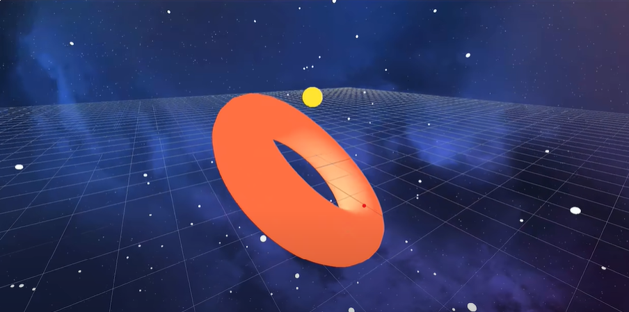
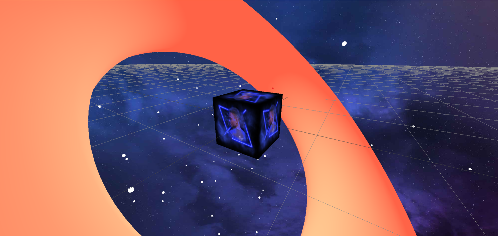
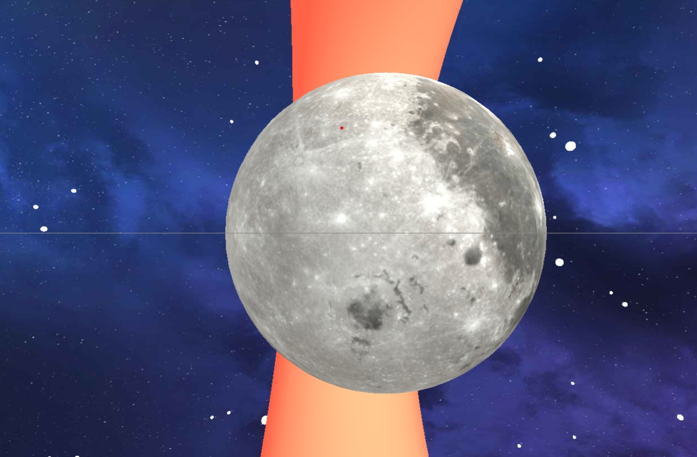
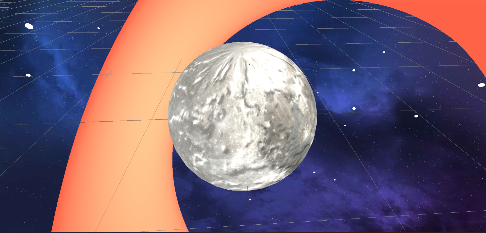

# Three js tutorial

- Js library for rendering 3d in the browser ([click to visit documentation](https://threejs.org/docs/index.html#manual/en/introduction/Creating-a-scene).)

# Terms

- **Scene**
  Object that contains all yor cameras,objects and lights. Think of it as a container or our movie set.

  `const scene = new THREE.Scene();`

- **Camera**

  - This is what we use to look at things inside the scene. _Think of it as the eyes of the scene_. There various types of cameras but the most common is the [perspective camera](https://threejs.org/docs/index.html#api/en/cameras/PerspectiveCamera) which is designed to mimic what humans see.

    `const camera = new THREE.PerspectiveCamera()`

    `const camera = new THREE.PerspectiveCamera(75, aspectRatio,0.1,100);`

  - Its 1st argument is the _field of view_ which is the amount of the world thats visible based on a full 360deg. (_Most times you will use 75deg_).
  <figure>
  
  <caption>Field of View</caption>
  </figure>
  - Its Second Arguement is **Aspect Ratio** which is based on the users browser window.(_We can get this by dividing the width of the widow by the height_).
  - The remaining arguements are for the _View Frustram_.Contraols which objects are visible relative to the camera.
  <figure>
  
  <caption> Field of View </caption>
  </figure>
  
  - **Renderer**
    - Renders the graphics to the scene.Rendering is basically drawing.

  ```js
  //select canvas
  const bgCanvas = document.querySelector("#bg");
  // create a renderer
  const renderer = new THREE.WebGLRenderer({
    canvas: bgCanvas,
  });
  // set pixel ratio to the window Pixel ratio
  renderer.setPixelRatio(window.devicePixelRatio);
  // set renderer size to the windows size
  renderer.setSize(window.innerWidth, window.innerHeight);
  //but currently the camera is positioned in the middle of the scene so we move it on the z axis --->this will give us a better perspective when we start adding shapes
  camera.position.setZ(30);

  // call the renderer method and pass the scene and camera as an arguement. This is like telling it to draw on the scene.
  renderer.render(scene, camera);
  ```

# Adding an objects

- There are 3 basic steps to add an object to the scene.

1. **Geometry**

- First you will need a geometry of a set of vectors that define the object its self ().But Three.js has prebuilt [geometries](https://threejs.org/docs/index.html#api/en/geometries/BoxGeometry)

2. **Material**

- This is basically the wrapping paper of the object.This can be a texture but there are many prebuilt [materials](https://threejs.org/docs/index.html#api/en/materials/Material) included in three.js.Note that you can write your custom shaders using webgl.

```js
// Add  Ring
const geometry = new THREE.TorusGeometry(10, 3, 16, 100);
// Most materials require a light source but the basic ones dont
const material = new THREE.MeshBasicMaterial({
  color: 0xff6347, //   0X IS A HEXADECIMAL value
  wireframe: true, // shows its geometry
});
```

- if you want to add light you can use a meshstanderdmaterial.which takes in light properties.click to follow thorught to the [section](#adding-light).

3. **Mesh**

- This is pretty much combining the geometry with the material.

```js
const torus = new THREE.Mesh(geometry, material);
// To add the shape to the scene
scene.add(torus);
// now to see it we need to rerender the scene on the page
renderer.render(scene, camera);
```

- At this point You should see this.
<figure>
  
</figure>
- _Quick tip_: to prevent you from rerendering the scene recurcively.use this

```js
function animate() {
  // THis tells the browser that your going to animate something.
  requestAnimationFrame(animate);
  // so that every time the browser repaints the screen it calls ypur render method
  renderer.render(scene, camera);
  //   you can think of this as a gameloop.
}
// call animate.
animate();
```

## Now to animate the shape.

- So every shae we create has different properties like shape ,rotation , scale e.t.c. and if we change the properties inside the loop the shape will animate.

```js
function animate() {
  requestAnimationFrame(animate);
  // Now we shall update the x y and z postiotions for every animation frame.
  torus.rotation.x += 0.01;
  torus.rotation.y += 0.005;
  torus.rotation.z += 0.01;
  renderer.render(scene, camera);
}
// So back in the browser you should see the shape animating.
animate();
```

### Adding Light.

- There are many lights in three.js but the best to get started with is a [point light](https://threejs.org/docs/index.html#examples/en/lights/LightProbeGenerator) which emits light in all directions like a light bulb💡.

```js
const material = new THREE.MeshStandardMaterial({
  color: 0xff6347,
  // wireframe: true,
});

const torus = new THREE.Mesh(geometry, material);
scene.add(torus);
// create the point light.
const pointlight = new THREE.PointLight(0xffffff);
// we move the light away from the center
// the smaller the value the closer the light
pointlight.position.set(5, 5, 5);
// add the light to the Scene
scene.add(pointlight);
```


- But if you want the whole scene lit up you can use na Ambient light.

```js
const ambientLight = new THREE.AmbientLight(0xffffff);
scene.add(pointlight, ambientLight);
```


- Using Light helpers

```js
const lighthelper = new THREE.PointLightHelper(pointlight);
// adds a line acroos the screen
const gridhelper = new THREE.GridHelper(200, 50);
scene.add(lighthelper, gridhelper);
```


### Adding Orbit controlls

- Orbit controls help you move the model around.Import it like this.
  `import {OrbitControls} from "three/examples/jsm/controls/OrbitControls"`

```js
// this will listen to dom events on the mouse and update the camera position acordingly
const controls = new OrbitControls(camera, renderer.domElement);
function animate() {
  requestAnimationFrame(animate);
  torus.rotation.x += 0.01;
  torus.rotation.y += 0.005;
  torus.rotation.z += 0.01;

  // we call this to make sure thatthe controls are updated
  controls.update();
  renderer.render(scene, camera);
}

animate();
```

- Now you should be able to see the grid fully and pan around using your mouse..
  

### Rnadom generation.

```js
// creating stars with random generation.
function addStar() {
  const geometry = new THREE.SphereGeometry(0.25, 24, 24); //0.25 is radius
  const material = new THREE.MeshStandardMaterial({ color: 0xffffff });
  const star = new THREE.Mesh(geometry, material);
  // randomly genrate an xyz value for wach stars
  // Creat an array of  3 values and for each item generate a number between negative and positive 100.
  const [x, y, z] = Array(3)
    .fill(undefined)
    .map(() => THREE.MathUtils.randFloatSpread(100));
  star.position.set(x, y, z);
  scene.add(star);
}
Array(200).fill(undefined).forEach(addStar);
```



### Adding textures with Images.

- [Textureloader](https://threejs.org/docs/#api/en/loaders/TextureLoader)

```js
// loading texture
// you can pass a call back to notify when the image is done loading.
const spaceTexture = new THREE.TextureLoader().load(
  "src/assets/textures/space.jpg"
);
scene.background = spaceTexture;
```



### Texture Mapping

- Is process of taking 2d pixels and mappping them on a 3dimensional geometry

```js
const kolynzTexture = new THREE.TextureLoader().load(
  "src/assets/textures/kolynz.png"
);
const kolynz = new THREE.Mesh(
  new THREE.BoxGeometry(3, 3, 3),
  new THREE.MeshBasicMaterial({ map: kolynzTexture })
);

scene.add(kolynz);
```



### adding multiple maps

- creating the moon

```js
const moonTexture = new THREE.TextureLoader().load(
  "src/assets/textures/moon.jpg"
);
const normalTexture = new THREE.TextureLoader().load(
  "src/assets/textures/normal.jpg"
);
const moon = new THREE.Mesh(
  new THREE.SphereGeometry(3, 32, 32),
  new THREE.MeshStandardMaterial({ map: moonTexture })
);
scene.add(moon);
moon.position.x += 5;
```



Adding normal map texture adds depth and makes it more realistic.
`new THREE.MeshStandardMaterial({ map: moonTexture,normalMap:normalTexture })`


### Animate on scroll

```js
// add scrolling effect to scene
function moveCamera() {
  // get us how far we are from the top of the page
  const t = document.body.getBoundingClientRect().top;

  moon.rotation.x += 0.05;
  moon.rotation.y += 0.075;
  moon.rotation.z += 0.05;

  kolynz.rotation.y += 0.01;
  kolynz.rotation.z += 0.01;

  camera.position.z = t * -0.01;
  camera.position.x = t * -0.002;
  camera.position.y = t * -0.002;
}
// fires function everytime the user scrolls
document.body.onscroll = moveCamera;
```

<iframe width="560" height="315" src="https://www.youtube.com/embed/Q7AOvWpIVHU" title="YouTube video player" frameborder="0" allow="accelerometer; autoplay; clipboard-write; encrypted-media; gyroscope; picture-in-picture" allowfullscreen></iframe>

# [Bruno Simon tutorial ](https://youtu.be/tVr89249gwM?list=TLPQMzAwNjIwMjL_3gEpKFV1aA)

visit [tut](/Bruno.md)
